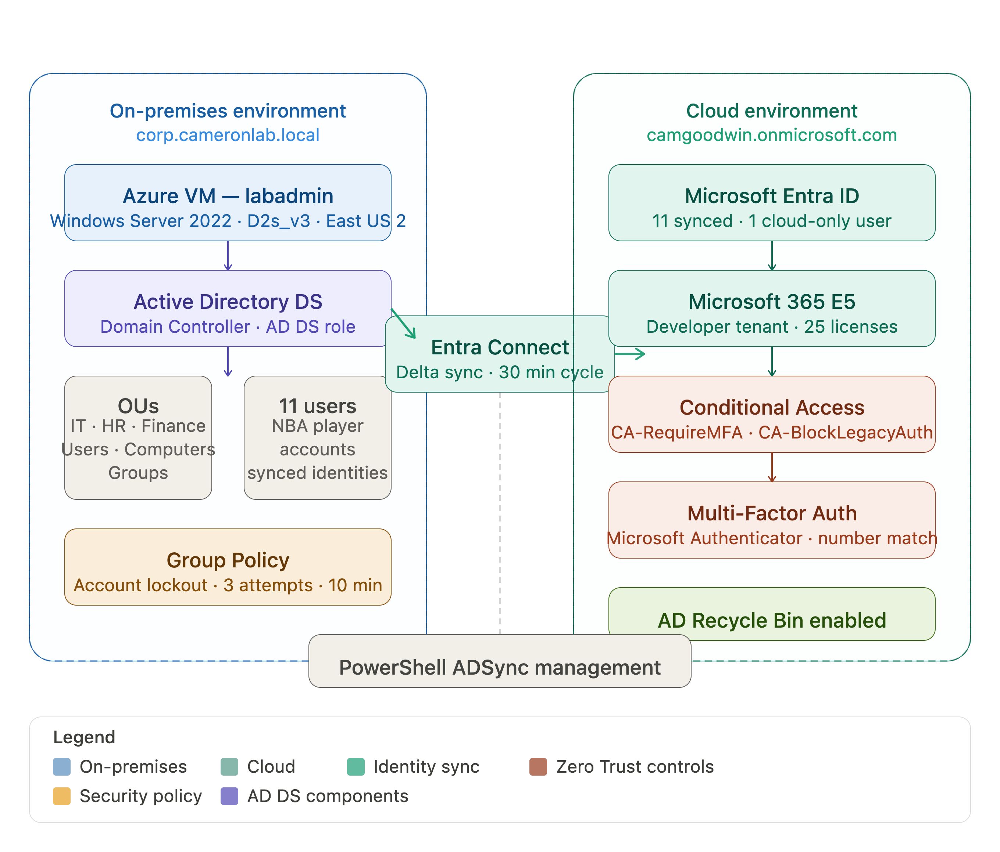

# Hybrid Identity & Azure Infrastructure Lab

## Overview

This lab demonstrates an enterprise-grade hybrid identity environment built entirely in Microsoft Azure. The environment replicates the identity infrastructure used by organizations running Microsoft 365 and Azure services — where on-premises Active Directory is the authoritative identity source, synchronized to Microsoft Entra ID in the cloud via Microsoft Entra Connect.

The lab covers the full lifecycle of enterprise identity management: deploying and configuring Active Directory, building an organizational structure, managing user identities, establishing hybrid sync, enforcing Zero Trust security controls, and resolving real-world support scenarios.

---

## Architecture

```
┌─────────────────────────────────┐         ┌──────────────────────────────────┐
│     ON-PREMISES ENVIRONMENT     │         │        CLOUD ENVIRONMENT         │
│                                 │         │                                  │
│  Windows Server 2022 (labadmin) │         │      Microsoft Entra ID          │
│  Standard D2s_v3 · East US 2    │──────►  │  camgoodwin.onmicrosoft.com      │
│                                 │  Entra  │                                  │
│  Active Directory Domain        │ Connect │  ┌────────────────────────────┐  │
│  Services (AD DS)               │  Sync   │  │     Microsoft 365 E5       │  │
│  corp.cameronlab.local          │         │  │  Conditional Access + MFA  │  │
│                                 │         │  └────────────────────────────┘  │
└─────────────────────────────────┘         └──────────────────────────────────┘
```



---

## Technologies Used

| Technology | Purpose |
|---|---|
| Microsoft Azure | Cloud infrastructure hosting |
| Windows Server 2022 | On-premises domain controller |
| Active Directory Domain Services | On-premises identity management |
| Microsoft Entra Connect | Hybrid identity synchronization |
| Microsoft Entra ID | Cloud identity platform |
| Microsoft 365 E5 Developer | Cloud productivity and licensing |
| Conditional Access | Zero Trust policy enforcement |
| Multi-Factor Authentication | Identity verification |
| PowerShell | Automation and sync management |
| Group Policy Management | Security policy configuration |

---

## Lab Objectives

- Deploy and configure a Windows Server 2022 Domain Controller in Microsoft Azure
- Build an enterprise Active Directory structure with OUs, security groups, and user accounts
- Establish hybrid identity synchronization via Microsoft Entra Connect
- Assign and manage Microsoft 365 licenses for synced users
- Enforce Zero Trust security controls through Conditional Access policies
- Simulate and resolve real enterprise IT support scenarios

---

## Environment Details

| Component | Value |
|---|---|
| Azure VM Name | labadmin |
| VM Size | Standard D2s_v3 |
| Region | East US 2 |
| Operating System | Windows Server 2022 Datacenter |
| On-Premises Domain | corp.cameronlab.local |
| M365 Tenant Domain | camgoodwin.onmicrosoft.com |
| M365 Subscription | Microsoft 365 E5 Developer (Renewable) |
| Total Users | 11 on-premises synced + 1 cloud-only (James Harden) |

---

## Build Documentation

### Phase 1 — Azure VM Deployment

Deployed a Windows Server 2022 virtual machine in Microsoft Azure to serve as the on-premises domain controller for the lab environment.

**Deployment Note:** During initial deployment encountered BS Family vCPU unavailability in East US due to regional capacity constraints. Azure portal confirmed BS series unavailable in region via quota recommendations page. Resolved by selecting Standard D2s_v3 in East US 2 as alternative. Lab environment fully functional on D2s_v3.

*This was the first real troubleshooting scenario of the lab — a production-like constraint that required adapting the deployment plan based on regional resource availability.*

**Screenshot:** VM overview — labadmin, Standard D2s_v3, East US Zone 2, Status: Running, Resource Group: RG-HybridIdentityLab

---

### Phase 2 — Active Directory Installation and Configuration

**AD DS Role Installation**

Installed the Active Directory Domain Services role via Server Manager Add Roles and Features Wizard. Selected Active Directory Domain Services along with Group Policy Management and Remote Server Administration Tools. Installation succeeded on destination server labadmin.

After installation completed the wizard prompted to promote the server to a Domain Controller via the notification flag in Server Manager.

**Screenshot:** Add Roles and Features Wizard — Installation progress showing AD DS, Group Policy Management, and AD DS Tools successfully installed on labadmin

**Domain Controller Promotion**

Ran the Active Directory Domain Services Configuration Wizard to promote the server to a Domain Controller. Created a new forest with root domain `corp.cameronlab.local`. Configured DSRM password during promotion. Installation completed with DNS configuration and server restart.

**About DSRM:**
DSRM (Directory Services Restore Mode) provides emergency access to the Domain Controller outside of Active Directory — used for AD database recovery scenarios where normal domain authentication is unavailable. In enterprise environments this credential is stored in a privileged access management vault. Losing the DSRM password in a production environment is a critical incident requiring escalation.

**Screenshot:** Server Manager Dashboard showing AD DS, DNS, File and Storage Services, and Local Server roles all active — confirming successful Domain Controller promotion

---

**Organizational Unit Structure**

Built the following OU hierarchy under `corp.cameronlab.local` via Active Directory Users and Computers:

```
corp.cameronlab.local
├── OU=Users
├── OU=IT
├── OU=HR
├── OU=Finance
├── OU=Computers
└── OU=Groups
```

**Why OU Structure Matters:**
Organizational Units provide a hierarchical structure for organizing AD objects by department or function. OUs enable granular Group Policy application, delegated administration, and simplified user management at scale — allowing IT teams to apply policies to entire departments rather than individual accounts.

**Screenshot:** Full OU tree expanded in Active Directory Users and Computers showing all 6 OUs under corp.cameronlab.local

---

**Security Groups**

Created the following security groups inside `OU=Groups`:

| Group Name | Members | Source OU |
|---|---|---|
| GRP-ITAdmins | Anthony Edwards, Carmelo Anthony, Derrick Rose | OU=IT |
| GRP-HRUsers | Dwayne Wade, Jalen Brunson, Kobe Bryant, Kyrie Irving | OU=HR |
| GRP-FinanceUsers | Kyrie Irving, LeBron James, Michael Jordan, Stephen Curry | OU=Finance |
| GRP-AllEmployees | Organization-wide access | All OUs |

**Why Security Groups Matter:**
Security Groups control access to resources at the group level rather than the individual user level. Assigning permissions to groups instead of users reduces administrative overhead — when a user changes roles you update their group membership rather than reconfiguring individual resource permissions across the environment.

**Screenshots:** GRP-ITAdmins members tab showing Anthony Edwards, Carmelo Anthony, Derrick Rose from corp.cameronlab.local/OU=IT; GRP-HRUsers members tab showing Dwayne Wade, Jalen Brunson, Kobe Bryant from OU=HR; GRP-FinanceUsers members tab showing Kyrie Irving, LeBron James, Michael Jordan, Stephen Curry from OU=Finance

---

**User Accounts**

Created 11 on-premises AD user accounts named after NBA players and distributed across department OUs:

**OU=IT (3 users):**
Anthony Edwards, Carmelo Anthony, Derrick Rose

**OU=HR (4 users):**
Dwayne Wade, Jalen Brunson, Kobe Bryant, Kyrie Irving

**OU=Finance (4 users):**
LeBron James, Michael Jordan, Ray Allen, Stephen Curry

**Screenshot:** Each OU showing its respective users — OU=IT with Anthony Edwards/Carmelo Anthony/Derrick Rose; OU=HR with Dwayne Wade/Jalen Brunson/Kobe Bryant/Kyrie Irving; OU=Finance with LeBron James/Michael Jordan/Ray Allen/Stephen Curry

---

### Phase 3 — IT Support Simulations (On-Premises)

**Password Reset**

Performed password reset on Kyrie Irving via ADUC right click → Reset Password dialog. Reset Password dialog confirmed Account Lockout Status: Unlocked. Confirmation dialog displayed "The password for Kyrie Irving has been changed."

**Screenshot:** Reset Password dialog for Kyrie Irving; confirmation dialog showing password changed successfully

---

**Account Lockout and Unlock**

Configured Account Lockout Policy via Group Policy Management:
- Opened Group Policy Management → Default Domain Policy → Edit
- Navigated to: Computer Configuration → Policies → Windows Settings → Security Settings → Account Policies → Account Lockout Policy
- Configured settings:
  - Account lockout threshold: **3 invalid logon attempts**
  - Account lockout duration: **10 minutes**
  - Reset account lockout counter after: **10 minutes**

**Screenshot:** Group Policy Management Editor showing Account Lockout Policy — Account lockout threshold highlighted showing 3 invalid logon attempts

Triggered account lockout by attempting sign-in with incorrect credentials 3 times. Verified lockout status in ADUC Reset Password dialog — Account Lockout Status changed from Unlocked to **Locked out**. Resolved by checking "Unlock the user's account" checkbox in Reset Password dialog alongside password reset.

**Screenshot:** Reset Password dialog showing Account Lockout Status: Locked out with Unlock the user's account checkbox checked

---

**Account Disable and Re-enable**

Demonstrated account disable and re-enable workflow using multiple users including Kobe Bryant and Jalen Brunson. Right clicked user → Disable Account / Enable Account. AD confirmation dialogs displayed for each action.

**Screenshots:** "Object Kobe Bryant has been disabled" confirmation; "Object Kobe Bryant has been enabled" confirmation; "Object Jalen Brunson has been enabled" confirmation

---

**User OU Move**

Demonstrated moving users between OUs using the Move dialog. Right clicked user → Move → selected destination OU from the container tree. OU=HR selected as destination confirming the move workflow.

**Screenshot:** Move dialog showing full OU container tree with OU=HR selected as destination

---

### Phase 4 — Microsoft 365 Developer Tenant Setup

Set up Microsoft 365 Developer Program sandbox tenant at developer.microsoft.com.

**Tenant Details:**
- Domain: camgoodwin.onmicrosoft.com
- Subscription: Renewable E5 (53 days remaining at time of screenshot)
- Admin account: camgood03@camgoodwin.onmicrosoft.com
- Licenses: 25 available (9 assigned at time of setup)

**Screenshot:** Microsoft 365 Developer Program profile showing camgoodwin.onmicrosoft.com domain, Renewable E5 subscription, 53 days remaining

---

### Phase 5 — Hybrid Identity Setup via Microsoft Entra Connect

**Microsoft Entra Connect Installation and Configuration**

Downloaded Microsoft Entra Connect (formerly Azure AD Connect) from the official Microsoft Entra admin center on the Windows Server VM. Ran the setup wizard using Express Settings.

**Credentials Required:**
- M365 Global Admin: camgood03@camgoodwin.onmicrosoft.com
- On-Premises Domain Admin: corp.cameronlab.local\labadmin

**Troubleshooting — Domain Credential Error:**
During the Connect to AD DS step the wizard auto-populated CONTOSO.COM\labadmin as the domain credential. This caused the error: "The domain specified in the credentials does not exist or cannot be contacted."

Root cause: CONTOSO.COM is Microsoft's default placeholder domain that auto-populates in the Entra Connect wizard. Resolved by replacing with the correct fully qualified domain name: corp.cameronlab.local\labadmin. Sync completed successfully after correction.

**Screenshot:** Entra Connect Configuration complete screen — "Microsoft Entra Connect Sync configuration succeeded. The synchronization process has been initiated."

---

**Sync Verification**

After configuration navigated to entra.microsoft.com → Users to verify sync results.

Results: All 11 on-premises AD users appeared in Microsoft Entra ID with On-premises sync: Yes confirmed for each user. Users provisioned with UPNs mapped to tenant domain (@camgoodwin.onmicrosoft.com).

**Screenshot:** Entra ID Users page showing all 11 NBA players with On-premises sync column showing Yes for each synced user

Individual user verification performed on Anthony Edwards profile showing:
- On-premises sync enabled: Yes
- On-premises last sync date time: Jun 23, 2026, 2:09 PM
- On-premises distinguished name: CN=Anthony Edwards, OU=IT
- On-premises SAM account name: aedwards
- On-premises domain name: corp.cameronlab.local

**Screenshot:** Anthony Edwards Entra ID profile showing full on-premises sync details

---

**AD Recycle Bin**

Enabled the Active Directory Recycle Bin via Active Directory Administrative Center as a proactive environment hardening measure.

AD Administrative Center displayed confirmation: "AD DS has begun enabling Recycle Bin for this forest."

**Why this matters:** The AD Recycle Bin allows administrators to restore accidentally deleted AD objects — users, OUs, groups — without requiring a full backup restoration. In enterprise environments accidentally deleted objects are a real incident. Enabling the Recycle Bin is a foundational AD best practice.

**Screenshot:** Active Directory Administrative Center showing Recycle Bin confirmation dialog — "AD DS has begun enabling Recycle Bin for this forest"

---

### Phase 6 — Microsoft 365 License Assignment

Assigned Microsoft 365 E5 Developer licenses to synced users via M365 Admin Center (admin.microsoft.com).

Before assignment: All synced users displayed as Unlicensed in M365 Admin Center.

Assignment process: Navigated to each user → Licenses and apps tab → Selected Microsoft 365 E5 Developer (without Windows and Audio Conferencing) → Save changes. Confirmation message displayed: "Your changes have been saved."

**Screenshot:** M365 Admin Center user list showing all users before license assignment — Unlicensed status visible; Michael Jordan license page showing M365 E5 Developer assigned with "Your changes have been saved" confirmation

**Key principle:** In hybrid environments license assignment is performed from M365 Admin Center. However identity attributes and passwords must always be managed from on-premises AD — the cloud is read-only for synced identity attributes.

---

### Phase 7 — Zero Trust Security Configuration

**Authentication Methods Configuration**

Configured Authentication Methods policies in Entra ID Security center. Microsoft Authenticator enabled for all users as the primary MFA method. Additional methods configured: Passkey (FIDO2), Temporary Access Pass, Software OATH tokens, Email OTP all enabled.

**Screenshot:** Authentication methods policies page showing Microsoft Authenticator — All users — Enabled

---

**Conditional Access Policy 1 — Require MFA for All Users**

| Setting | Value |
|---|---|
| Policy Name | CA-RequireMFA-AllUsers |
| Users | All users |
| Target Resources | All resources (formerly All cloud apps) |
| Grant | 1 control selected (Require MFA) |
| Enable Policy | Report-only |
| Admin Exclusion | Excluded camgood03@camgoodwin.onmicrosoft.com |

Azure displayed lockout warning during policy creation recommending admin exclusion. Best practice followed — excluded Global Admin account to maintain emergency administrative access. In enterprise environments at least one break-glass admin account is always excluded from Conditional Access policies to prevent complete tenant lockout.

**Screenshot:** CA-RequireMFA-AllUsers policy configured showing all users, all resources, report-only mode, and admin exclusion warning with "Exclude current user" selected

---

**Conditional Access Policy 2 — Block Legacy Authentication**

| Setting | Value |
|---|---|
| Policy Name | CA-BlockLegacyAuth |
| Users | All users |
| Conditions | 1 condition selected (Legacy authentication clients) |
| Grant | Block access |
| Enable Policy | Report-only |

**What legacy authentication is and why blocking it matters:**
Legacy authentication protocols such as POP3, IMAP, SMTP, and Basic Auth were designed before modern security requirements and do not support multi-factor authentication. Blocking legacy authentication closes a critical attack vector — an attacker with stolen credentials could bypass MFA entirely by authenticating through a legacy protocol. In enterprise environments blocking legacy auth is a foundational Zero Trust requirement.

**What report-only mode does:**
Report-only mode allows administrators to evaluate the impact of a Conditional Access policy before enforcement. The policy logs which users and sign-ins would have been affected without actually blocking or requiring anything. This is critical in enterprise environments where an incorrectly configured policy pushed directly to On could lock out hundreds of users simultaneously.

**Screenshot:** CA-BlockLegacyAuth policy showing all users, 1 condition selected, Block access, Report-only mode

---

**MFA Sign-in Test**

Switched CA-RequireMFA-AllUsers policy from Report-only to On. Authenticated as synced user aedwards@camgoodwin.onmicrosoft.com via incognito browser session. Sign-in prompted "Let's keep your account secure" — MFA registration required before accessing M365 resources. Completed number matching verification — number 38 displayed, confirmed in Microsoft Authenticator app.

**Screenshots:** aedwards@camgoodwin.onmicrosoft.com sign-in entering password; "Let's keep your account secure" MFA setup prompt; Number matching screen showing "38" — enter in Authenticator app to approve

---

## Troubleshooting Scenarios

### Scenario 1 — Sync Failure Simulation

**Objective:** Simulate an Entra Connect sync outage and validate recovery procedure.

**Steps Performed:**
1. Opened Windows PowerShell as Administrator on VM
2. Stopped ADSync service:
```powershell
Stop-Service -Name "ADSync"
```
3. Made on-premises AD change during outage to confirm changes do not propagate while sync is down
4. Restarted ADSync service:
```powershell
Start-Service -Name "ADSync"
```
WARNING: Waiting for service 'Microsoft Azure AD Sync (ADSync)' to start...

5. Forced manual delta sync:
```powershell
Start-ADSyncSyncCycle -PolicyType Delta
```
Result: **Success**

**Screenshot:** PowerShell window showing full command sequence — Stop-Service, Start-Service with waiting warning, Start-ADSyncSyncCycle -PolicyType Delta with Result: Success output

**Resolution:** ADSync service restart initiated automatic sync cycle. Manual delta sync forced to accelerate propagation. Result confirmed as Success.

**Key Learning:** In enterprise environments an Entra Connect sync failure is a critical incident. New users won't appear in the cloud, password changes won't propagate, and deprovisioned accounts may retain cloud access creating a security risk. The Start-ADSyncSyncCycle -PolicyType Delta command is the standard resolution for forcing immediate sync propagation rather than waiting for the default 30 minute automatic cycle.

---

### Scenario 2 — User Access Revocation and Restoration

**Objective:** Simulate emergency account disable and validate access restoration in a hybrid environment.

**Steps Performed:**
1. Right clicked Dwayne Wade in OU=HR → Disable Account (context menu visible showing Disable Account option)
2. Forced delta sync to propagate disable to cloud
3. Attempted sign-in as dwade@camgoodwin.onmicrosoft.com via incognito browser
4. Sign-in returned: "Your account or password is incorrect" — confirming cloud access blocked after sync propagation
5. Right clicked Dwayne Wade → Enable Account (context menu showing Enable Account highlighted)
6. Forced delta sync
7. Reset password on-premises in ADUC
8. Waited for sync propagation — approximately 2-3 minutes
9. Verified sign-in restored

**Screenshots:** ADUC context menu showing Disable Account for Dwayne Wade; dwade@camgoodwin.onmicrosoft.com sign-in showing incorrect password error after account disabled; ADUC context menu showing Enable Account highlighted for Dwayne Wade

**Troubleshooting Encountered During This Scenario:**
Initial access restoration attempts failed despite re-enabling account in ADUC. Cloud-side password reset attempted in M365 Admin Center — did not resolve issue. Multiple users tested during troubleshooting including Carmelo Anthony (canthony@camgoodwin.onmicrosoft.com) showing same incorrect password error.

Root cause identified: In hybrid identity environments synced user attributes including passwords are managed on-premises and replicated to Entra ID via sync cycle. Cloud-side password changes are overwritten by the next sync back to the on-premises value. Resolved by resetting password directly in ADUC on-premises and forcing delta sync. Access restored after allowing 2-3 minutes for propagation.

**Key Learning — Hybrid Identity Management Rule:**
Synced identities must always be managed from the on-premises AD source. The on-premises AD is the authoritative source — Entra ID is read-only for synced user attributes. Cloud-side changes will be overwritten by the next sync cycle.

**Key Learning — Propagation Timing:**
After forcing delta sync, changes require 2-3 minutes to fully propagate. Premature sign-in attempts during propagation return authentication errors even when credentials are correct. In enterprise environments this delay is important context when communicating resolution timelines to end users.

---

### Scenario 3 — New User MFA Onboarding

**Objective:** Simulate new employee first-time MFA registration workflow.

**Steps Performed:**
1. Created cloud-only user James Harden (jharden@camgoodwin.onmicrosoft.com) in M365 Admin Center
2. Assigned M365 E5 Developer license
3. Opened incognito browser session
4. Signed in as jharden@camgoodwin.onmicrosoft.com for the first time
5. MFA registration prompted — "Scan the QR code" screen displayed for Microsoft Authenticator setup
6. Scanned QR code with Microsoft Authenticator app
7. Completed number matching verification — number 18 displayed for jbrunson sign-in test
8. MFA registration and sign-in completed successfully

**Screenshots:** jharden@camgoodwin.onmicrosoft.com QR code scan screen for Microsoft Authenticator setup; jbrunson@camgoodwin.onmicrosoft.com Approve sign in request showing number 18 for MFA number matching

**Troubleshooting Encountered:**
During MFA verification testing for jbrunson@camgoodwin.onmicrosoft.com encountered: "Sorry, we're having trouble verifying your account." Error presented options to approve via Authenticator app or use a verification code. This occurred due to timing between number matching prompt and Authenticator app response. Resolved by retrying the sign-in flow.

**Screenshot:** jbrunson@camgoodwin.onmicrosoft.com "Verify your identity" error screen showing trouble verifying account message

**Cloud-Only vs Synced Identity:**
Cloud-only identities exist exclusively in Microsoft Entra ID with no relationship to on-premises directory — created and managed entirely in the cloud. Synced identities originate in on-premises AD and are replicated to Entra ID via Entra Connect — the on-premises AD remains the authoritative source. In hybrid enterprise environments synced identities are standard as most organizations maintain existing on-premises infrastructure alongside cloud services.

**Key Learning:** First-time MFA registration is a workflow IT support teams facilitate during every new hire onboarding. Understanding the registration experience including common friction points is essential for providing effective helpdesk support around MFA-related tickets.

---

### Scenario 4 — License Management

**Objective:** Understand license management and conflict scenarios in M365 environments.

**Finding:** Modern M365 Admin Center UI prevents duplicate license assignment by greying out already-assigned licenses, preventing UI-based conflicts. License conflicts in enterprise environments typically occur in the following scenarios:

- Migrations between tenants where users carry conflicting license assignments
- PowerShell bulk license assignment scripts with logic errors
- Tenant mergers where license SKUs overlap
- Role changes where old licenses are not removed before new ones are assigned

**Resolution Process for License Management:**
1. Navigate to M365 Admin Center → Users → Active Users
2. Select user → Licenses and apps tab
3. Check or uncheck license assignments as required
4. Click Save changes
5. Confirmation message: "Your changes have been saved"

**Screenshots:** Michael Jordan Licenses and apps page showing M365 E5 Developer assigned — 22 of 25 licenses available; "Your changes have been saved" confirmation

**Key Learning:** License management is a routine helpdesk function in enterprise M365 environments. Understanding license availability, assignment, and the impact of licensing on user access to M365 services is a core competency for IT support and cloud administration roles.

---

## Key Concepts Reference

| Concept | Definition |
|---|---|
| Hybrid Identity | Identity model where on-premises AD and cloud Entra ID are synchronized — single source of truth across both environments |
| Microsoft Entra Connect | Microsoft tool that bridges on-premises AD and Entra ID — syncs users, groups, and attributes on a scheduled 30-minute cycle |
| DSRM Password | Directory Services Restore Mode — emergency access to Domain Controller outside of AD for database recovery scenarios |
| Organizational Unit | Hierarchical container in AD for organizing objects by department — enables Group Policy application and delegated administration |
| Security Group | AD object for managing resource access at group level rather than individual user level |
| Conditional Access | Entra ID policy engine enforcing access controls based on user, device, location, and risk signals |
| Report-Only Mode | CA policy simulation mode — logs impact without enforcing — used to validate policy before going live |
| Legacy Authentication | Older protocols (POP3, IMAP, Basic Auth) that don't support MFA — blocking these closes a critical attack vector |
| Break-Glass Account | Emergency admin account excluded from Conditional Access policies to prevent complete tenant lockout |
| Delta Sync | Incremental Entra Connect sync processing only changes since last cycle — faster than full sync |

---

## Key Learnings

1. **Hybrid environments require on-premises management** — synced user attributes including passwords must always be managed from on-premises AD, never from the cloud portal directly

2. **Sync propagation takes time** — changes made on-premises require a sync cycle plus 2-3 minutes propagation before taking effect in the cloud

3. **Break-glass accounts are non-negotiable** — always exclude at least one admin account from Conditional Access policies before going live

4. **Report-only mode before enforcement** — always validate Conditional Access policies in report-only mode before switching to On in production

5. **Legacy authentication blocking is foundational** — MFA enforcement is ineffective without blocking legacy auth protocols that can bypass it entirely

6. **Real troubleshooting produces the best documentation** — the most valuable entries capture the problem, the failed attempts, the root cause, and the resolution — not just the final working state

7. **Deployment constraints are real-world experience** — adapting to Azure regional capacity constraints (BS Family vCPU unavailability) mirrors production environment problem-solving

---

## Lab Completion Summary

Hybrid Identity Lab complete. Deployed Windows Server 2022 on Azure (Standard D2s_v3, East US Zone 2, Resource Group: RG-HybridIdentityLab), configured Active Directory Domain Services, promoted Domain Controller for domain corp.cameronlab.local. Built enterprise OU structure across 6 organizational units with 11 user accounts distributed across IT, HR, and Finance departments and assigned to 4 security groups. Enabled AD Recycle Bin as proactive environment hardening measure. Established hybrid identity via Microsoft Entra Connect — verified successful synchronization of all 11 on-premises users to Microsoft Entra ID tenant camgoodwin.onmicrosoft.com with on-premises sync confirmed on each user profile. Created 1 cloud-only user (James Harden) for MFA onboarding simulation. Assigned Microsoft 365 E5 Developer licenses to users. Configured authentication methods with Microsoft Authenticator enabled for all users. Implemented Zero Trust security controls via two Conditional Access policies: MFA enforcement for all users and legacy authentication blocking, both with break-glass admin exclusion applied. Completed four enterprise troubleshooting simulations covering sync failure and recovery using PowerShell ADSync commands, user access revocation and restoration in a hybrid environment demonstrating on-premises-first management principle, new user MFA onboarding workflow, and license management procedures.
